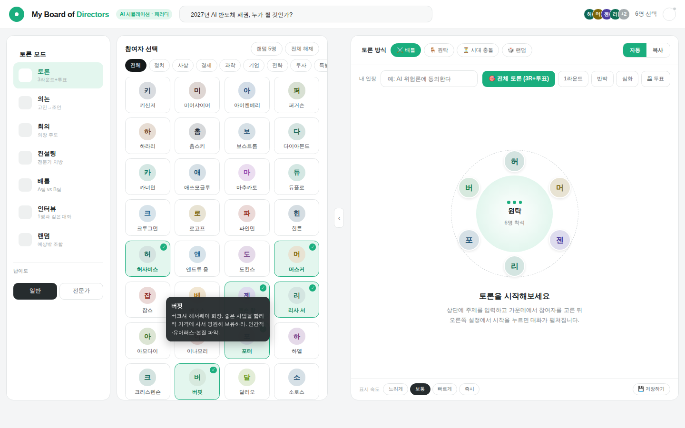

# 🪑 My Board of Directors — 마이 보드 디렉터

역사상 가장 영향력 있는 정치가·사상가·경제학자·과학자·경영자·투자자들을 나만의 "가상 이사회"로 소집해, 내가 던진 주제로 토론·의논·회의·컨설팅·인터뷰를 시키는 싱글 파일 웹앱입니다.
백엔드 서버가 없고, **당신의 브라우저**와 **당신이 직접 입력한 AI API 키**만으로 동작합니다.

> A single-file web app that lets you convene a "virtual board of directors" made up of history's most influential political thinkers, economists, scientists, founders, and investors — and have them debate, discuss, or consult on any topic you throw at them. No backend server required: it runs entirely in your browser, using an AI API key that **you** provide.

<p>
  
  
  
</p>



🎥 **데모 영상**: [`my-board-of-directors-demo.mp4`](./my-board-of-directors-demo.mp4) 참고 (API 응답은 데모용으로 목(mock) 처리된 화면입니다)

---

## ✨ 주요 기능

- **7가지 진행 모드** — 토론(찬반 3라운드+투표) · 의논 · 회의 · 컨설팅 · 배틀(A팀 vs B팀) · 인터뷰(1:1 소크라테스식) · 랜덤 조합
- **40명+ 페르소나** — 정치·외교, 사상가, 경제학자, 과학자, 기업인, 경영전략가, 투자자, 한국 커스텀 페르소나(호암, 사부님, 메르, 세이노 등)
- **원탁 시각화** — 선택한 인물들이 원형 좌석에 애니메이션으로 배치됨
- **말풍선 실시간 스트리밍** — 속도 조절(느리게/보통/빠르게/즉시) 가능, 라운드 중간에 사용자가 직접 끼어들어 의견 개진 가능
- **⚙️ API 키 직접 설정** — Anthropic(Claude) · OpenAI(GPT) · Google(Gemini) · 커스텀(OpenAI 호환 엔드포인트, 예: OpenRouter/Groq/로컬 LLM) 중 원하는 제공자를 선택하고, 발급받은 키를 넣으면 바로 동작
- **토론 기록 저장** — 진행된 토론 전체를 `.txt` 파일로 다운로드
- **완전 정적(static) 사이트** — 서버/DB 없이 GitHub Pages 등 어디에나 배포 가능

## 🚀 빠른 시작

### 방법 1 — 그냥 열기
`index.html` 파일을 더블클릭해서 브라우저로 열면 바로 사용할 수 있습니다.

### 방법 2 — GitHub Pages로 배포
1. 이 저장소를 Fork 또는 Clone
2. Settings → Pages → Branch를 `main`으로 설정
3. 몇 분 후 `https://<본인계정>.github.io/<저장소명>/` 에서 접속

### 방법 3 — 로컬 서버로 열기 (선택)
일부 브라우저는 `file://` 환경에서 fetch를 제한할 수 있습니다. 문제가 있다면:
```bash
python3 -m http.server 8000
# 브라우저에서 http://localhost:8000 접속
```

## 🔑 API 키 설정하기

우측 상단 **⚙️ 톱니바퀴 아이콘**을 누르면 설정 창이 열립니다.

| 제공자 | 키 발급 위치 | 비고 |
|---|---|---|
| **Anthropic (Claude)** | https://console.anthropic.com/settings/keys | 브라우저에서 직접 호출 시 `anthropic-dangerous-direct-browser-access` 헤더 사용 |
| **OpenAI (GPT)** | https://platform.openai.com/api-keys | |
| **Google (Gemini)** | https://aistudio.google.com/apikey | |
| **커스텀 (OpenAI 호환)** | 사용 중인 서비스 문서 참고 | OpenRouter, Groq, 로컬 LLM 서버(Ollama 등 OpenAI 호환 프록시) 등 `/chat/completions` 엔드포인트를 지원하면 Base URL만 입력해서 사용 가능 |

API 키는 **이 브라우저의 로컬 저장소(localStorage)에만 저장**되며, 어떤 서버로도 전송되지 않습니다. 선택한 AI 제공자에게만 직접 요청이 나갑니다. 공용 PC에서 사용했다면 설정 창의 "키 삭제" 버튼을 눌러 정리해주세요.

> 모델 ID는 자유롭게 바꿀 수 있습니다. 제공자별 최신 모델 목록은 각 서비스의 공식 문서를 참고하세요 (예: Anthropic은 [모델 문서](https://docs.claude.com/en/docs/about-claude/models)).

## 🎭 진행 모드

| 모드 | 설명 |
|---|---|
| 토론 | 찬반 구도로 3라운드 진행 후 투표까지 |
| 의논 | 고민을 공유하면 참여자들이 조언 |
| 회의 | 사용자가 의장이 되어 안건 논의 |
| 컨설팅 | 전문가 1~3명이 문제를 진단하고 처방 |
| 배틀 | A팀 vs B팀으로 나뉘어 정면 충돌 (인원 제한 없음) |
| 인터뷰 | 1명을 깊게 파고드는 소크라테스식 대화 |
| 랜덤 | 예상 밖의 조합으로 토론 |

## ⚠️ 중요 고지 (반드시 읽어주세요)

- 이 앱에 등장하는 모든 페르소나는 **공개된 저서·인터뷰·발언을 참고해 재구성한 AI 시뮬레이션**입니다. **실제 인물의 발언이 아니며**, 해당 인물이나 소속 기관의 감수·승인을 받지 않았습니다. 순수하게 학습·논평·패러디 목적의 창작물입니다.
- 일부 **현직 기업 CEO 등 생존 인물**의 이름은 저작권·초상권·명예훼손 리스크를 낮추기 위해 실제 이름과 살짝 다르게 표기했습니다 (예: 머스크 → 머스커, 베이조스 → 베조스, 젠슨 황 → 젠슨 항, 리사 수 → 리사 서, 아모데이 → 아모다이, 틸 → 티엘). 페르소나 설명에도 "~를 모티프로 한 가상 페르소나"라고 명시되어 있습니다.
- 본 프로젝트의 결과물을 실제 인물의 발언인 것처럼 인용·유포하지 마세요.
- 본 소프트웨어는 [LICENSE](./LICENSE)에 따라 **비상업적 용도로만** 사용할 수 있습니다.

## 🔒 개인정보 / 보안

- API 키는 브라우저 `localStorage`에만 저장됩니다. 이 저장소 코드에는 어떤 키도 포함되어 있지 않습니다.
- Anthropic/OpenAI/Gemini API를 브라우저에서 직접 호출하는 구조이므로, 네트워크 탭 등에서 요청이 각 제공자 도메인으로 직접 나가는지 언제든 확인할 수 있습니다(투명성).
- 신뢰할 수 없는 환경(공용 PC 등)에서 API 키를 입력하지 마세요.

## 📁 프로젝트 구조

```
.
├── index.html   # 전체 앱 (HTML+CSS+JS 싱글 파일)
├── README.md
└── LICENSE
```

## 🛠 기술 스택

순수 HTML / CSS / Vanilla JavaScript. 프레임워크·빌드 과정 없음. 폰트(Pretendard)와 아이콘(Phosphor Icons)만 CDN에서 불러옵니다.

## 🐞 알려진 한계

- 프롬프트에 "웹서치로 최신 데이터 수집" 요청이 포함되어 있지만, 실제 웹 브라우징 여부는 선택한 모델/제공자의 기능에 따라 다릅니다. 브라우징 기능이 없는 모델은 학습된 지식 범위 내에서만 답합니다.
- 일부 제공자는 브라우저에서의 직접 API 호출(CORS)을 제한할 수 있습니다. 오류가 발생하면 설정에서 제공자를 바꾸거나, 해당 제공자가 브라우저 직접 호출을 지원하는지 문서를 확인하세요.
- 페르소나의 발언은 AI가 생성한 시뮬레이션으로, 사실과 다르거나 편향될 수 있습니다. 중요한 의사결정에 그대로 사용하지 마세요.

## 🤝 기여

이슈와 PR을 환영합니다. 새 페르소나를 추가하거나 새로운 진행 모드를 제안하고 싶다면 이슈를 먼저 열어주세요.

## 📜 라이선스

[CC BY-NC 4.0](./LICENSE) — 저작자 표시, **비영리 목적에 한해** 사용·수정·재배포 가능합니다. 상업적 이용(판매, 유료 서비스 내 포함, 광고/구독 수익화 등)은 금지됩니다.

## 🙋 만든 사람

Olivia · B2B 전략 콘텐츠/플랫폼 빌더
